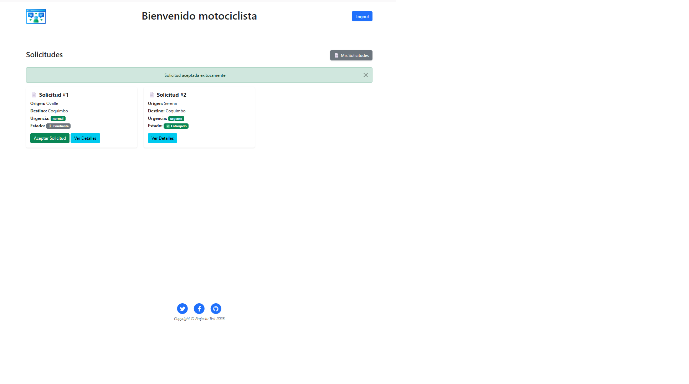
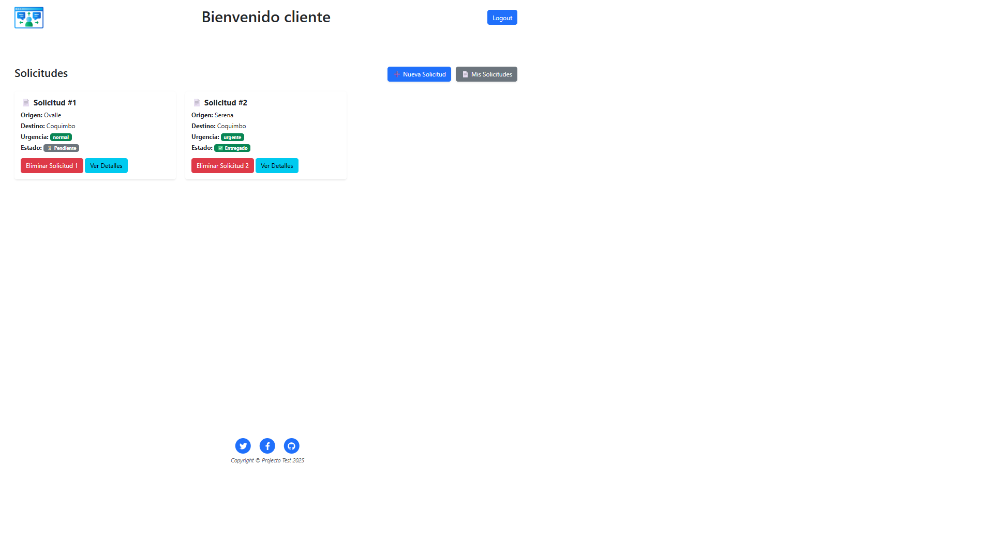

# Sistema de Gestión de Solicitudes

Aplicación web desarrollada con Flask que permite a usuarios crear y gestionar solicitudes de envío.
Incluye autenticación, roles y persistencia en base de datos.

## Tech Stack

- Python
- Flask
- SQLAlchemy
- Flask-Login
- Flask-WTF
- Flask-Migrate
- SQLite (local) / PostgreSQL (deploy)

## Features

- Registro y login de usuarios
- Roles: cliente y motociclista
- Creación de solicitudes
- Asignación de solicitudes
- Estados de solicitud
- Panel de control por rol

## Screenshots

## Setup local

pip install -r requirements.txt
flask run

## Deploy

[https://Tecnico.onrender.com](https://tecnico-j8wv.onrender.com/login)
